# Quick Setup

\*\*Estimated Time\*\*: 10-15 minutes to complete initial setup

### Overview

This guide will walk you through setting up Cirrus Sync from installation to your first successful sync. Follow these steps in order for the best experience.


### System Requirements

Before installation, verify your system meets the minimum requirements:

| Operating System | Minimum Version      | RAM  | Storage         | Additional Notes                |
| ---------------- | -------------------- | ---- | --------------- | ------------------------------- |
| Windows          | Windows 10 (64-bit)  | 4 GB | 2 GB free space | .NET Framework 4.8+ required    |
| macOS            | macOS 11.0 (Big Sur) | 4 GB | 2 GB free space | Apple Silicon & Intel supported |
| Ubuntu           | 20.04 LTS            | 2 GB | 1 GB free space | GTK 3.0+ required               |
| CentOS/RHEL      | 8.0+                 | 2 GB | 1 GB free space | GNOME or KDE desktop            |
| Fedora           | 35+                  | 2 GB | 1 GB free space | Wayland & X11 supported         |

\*\*Performance Tip\*\*: For optimal performance with large file collections (10,000+ files), we recommend 8 GB RAM and SSD storage.

### Installation Overview

The installation process varies by platform but follows these general steps:

```mermaid
flowchart TD
    A[Download Installer] --> B{Select Platform}
    B -->|Windows| C[Run .exe as Admin]
    B -->|macOS| D[Open .dmg & Drag to Applications]
    B -->|Linux| E[Install via Package Manager]
    
    C --> F[Launch Application]
    D --> F
    E --> F
    
    F --> G[Create Account or Sign In]
    G --> H[Connect Cloud Provider]
    H --> I{Provider Type}
    
    I -->|Google Drive| J[OAuth Authorization]
    I -->|Dropbox| K[OAuth Authorization]
    I -->|OneDrive| L[OAuth Authorization]
    I -->|Other| M[Provider-Specific Auth]
    
    J --> N[Configure First Sync]
    K --> N
    L --> N
    M --> N
    
    N --> O[Select Local Folder]
    O --> P[Select Remote Folder]
    P --> Q[Choose Sync Options]
    Q --> R[Start Initial Sync]
    R --> S[✅ Setup Complete]
    
    style A fill:#e1f5fe
    style S fill:#c8e6c9
    style B fill:#fff3e0
    style I fill:#fff3e0
```



_This flowchart shows the complete setup process from download to first successful sync._

_Figure 1: Cirrus Sync installation and setup workflow_

### Prerequisites

Before you begin, make sure you have:

Account with at least one cloud storage provider (Google Drive, Dropbox, OneDrive, etc.) Administrative privileges on your computer Stable internet connection At least 500MB of free disk space

### Step-by-Step Setup

Download the appropriate installer for your operating system:

````
<Tabs>
  <Tab title="Windows">
    1. Visit [cirrus-sync.com/download](https://cirrus-sync.com/download)
    2. Click "Download for Windows"
    3. Run the `.exe` installer as administrator
    4. Follow the installation wizard
    
    ```powershell
    # Alternative: Install via Windows Package Manager
    winget install CirrusSync.CirrusSync
    ```
  </Tab>
  
  <Tab title="macOS">
    1. Visit [cirrus-sync.com/download](https://cirrus-sync.com/download)
    2. Click "Download for macOS"
    3. Open the `.dmg` file and drag to Applications
    4. Launch from Applications folder
    
    ```bash
    # Alternative: Install via Homebrew
    brew install --cask cirrus-sync
    ```
  </Tab>
  
  <Tab title="Linux">
    1. Visit [cirrus-sync.com/download](https://cirrus-sync.com/download)
    2. Download the appropriate package (`.deb`, `.rpm`, or `.tar.gz`)
    3. Install using your package manager
    
    ```bash
    # Ubuntu/Debian
    sudo dpkg -i cirrus-sync_3.3.0_amd64.deb
    
    # CentOS/RHEL/Fedora
    sudo rpm -i cirrus-sync-3.3.0.x86_64.rpm
    ```
  </Tab>
</Tabs>
````

If you already have a Cirrus Sync account, skip to Step 3.

```
1. Launch Cirrus Sync application
2. Click **"Create New Account"**
3. Fill in your details:
   - Email address
   - Strong password (minimum 8 characters)
   - Confirm password
4. Verify your email address
5. Choose your subscription plan
```

Now let's connect your cloud storage account:

```
1. Click **"Add Cloud Provider"** in the main dashboard
2. Select your preferred provider from the list
3. Click **"Connect"** and authorize Cirrus Sync
4. Wait for the connection to be verified

<Warning>
**Security Note**: Cirrus Sync uses OAuth 2.0 for secure authentication. We never store your cloud provider passwords.
</Warning>

**Supported Providers:**
- Google Drive & Google Workspace
- Dropbox & Dropbox Business
- Microsoft OneDrive & SharePoint
- Apple iCloud Drive
- Amazon S3
- Box
```

Create your first synchronization folder:

```
1. Click **"New Sync"** from the main toolbar
2. Configure your sync settings:
   
   <Accordion title="📁 Local Folder">
     - Click **"Browse"** to select a local folder
     - Or create a new folder by clicking **"Create New"**
     - Choose a location with sufficient free space
   </Accordion>
   
   <Accordion title="☁️ Remote Folder">
     - Select your connected cloud provider
     - Choose the remote folder to sync with
     - You can select the root folder or create a new subfolder
   </Accordion>
   
   <Accordion title="⚙️ Sync Options">
     **Sync Type:**
     - **Two-way sync**: Changes sync in both directions (recommended)
     - **Upload only**: Only upload local changes to cloud
     - **Download only**: Only download cloud changes locally
     
     **Advanced Options:**
     - File filters (include/exclude patterns)
     - Sync schedule (real-time, hourly, daily)
     - Bandwidth limitations
   </Accordion>

3. Click **"Create Sync"** to save your configuration
```

Let's run your first synchronization:

```
1. Find your newly created sync in the main dashboard
2. Click the **"Start Sync"** button
3. Monitor the progress in the sync status panel
4. Wait for the "Sync Complete" notification

<Tip>
**Pro Tip**: Your first sync might take longer as it needs to analyze and upload/download all existing files. Subsequent syncs will be much faster!
</Tip>
```

Confirm everything is working correctly:

```
1. **Test file creation**: Create a test file in your local sync folder
2. **Wait for sync**: Watch for the sync indicator to show activity
3. **Check cloud storage**: Verify the file appears in your cloud provider
4. **Test from cloud**: Create a file in your cloud storage
5. **Verify local sync**: Confirm it appears in your local folder

✅ If both tests work, your setup is complete!
```

### Next Steps

Customize sync filters, scheduling, and performance settings Set up shared folders and team workspaces Configure encryption, access controls, and backup options Install and configure mobile apps for on-the-go access

### Troubleshooting Common Issues

\*\*Symptoms\*\*: Unable to connect to cloud provider

```
**Solutions**:
- Check your internet connection
- Verify your cloud provider credentials
- Temporarily disable firewall/antivirus
- Try connecting through a different network
- Contact support if issues persist
```

\*\*Symptoms\*\*: Sync taking much longer than expected

```
**Solutions**:
- Check available bandwidth in settings
- Pause other network-intensive applications
- Verify sufficient disk space on both local and cloud storage
- Consider syncing during off-peak hours
- Enable bandwidth throttling if on a metered connection
```

\*\*Symptoms\*\*: Files showing conflict status

```
**Solutions**:
- Review conflict resolution settings
- Check if multiple users are editing the same files
- Use version history to restore previous versions
- Consider using collaborative editing features
- Set up proper file locking for shared documents
```

\*\*Symptoms\*\*: Sync stopped due to insufficient storage

```
**Solutions**:
- Free up space in your cloud storage
- Upgrade your cloud storage plan
- Use selective sync to exclude large files
- Enable smart storage management
- Review and delete old/unnecessary files
```

### Additional Resources

For more detailed information, check out these helpful resources:

* 📖 **Complete User Guide** - Comprehensive guide for end users
* ⚙️ **Advanced Configuration** - Technical configuration options
* 🔧 **Troubleshooting Guide** - Common issues and solutions
* 📊 **API Documentation** - For developers building integrations
* 📋 **Release Notes** - Latest features and improvements
* 🌐 [**Official Website**](https://cirrus-sync.com) - Product information and pricing
* 💬 [**Community Forum**](https://community.cirrus-sync.com) - User discussions and tips
* 📺 [**Video Tutorials**](https://youtube.com/cirrus-sync) - Step-by-step visual guides

### Support Resources

Need additional help? Here are your options:

\- 📚 \[Complete Documentation]\(/user-guide/user-guide) - 🎥 \[Video Tutorials]\(https://tutorials.cirrus-sync.com) - 💬 \[Community Forum]\(https://community.cirrus-sync.com) - 📖 \[Knowledge Base]\(https://help.cirrus-sync.com) - 📧 \*\*Email\*\*: support@cirrus-sync.com - 🎫 \*\*Support Portal\*\*: \[support.cirrus-sync.com]\(https://support.cirrus-sync.com) - 💬 \*\*Live Chat\*\*: Available 9 AM - 5 PM EST (business accounts) - 📞 \*\*Phone\*\*: +1-800-CIRRUS-1 (enterprise accounts) - 🏢 \*\*Dedicated Account Manager\*\* - 🚀 \*\*Priority Support Queue\*\* - 🔧 \*\*Custom Configuration Assistance\*\* - 📊 \*\*Implementation Planning\*\* - Contact: enterprise@cirrus-sync.com

***

\*\*Congratulations!\*\* 🎉 You've successfully set up Cirrus Sync. Your files are now automatically synchronized across all your devices and cloud storage providers.
